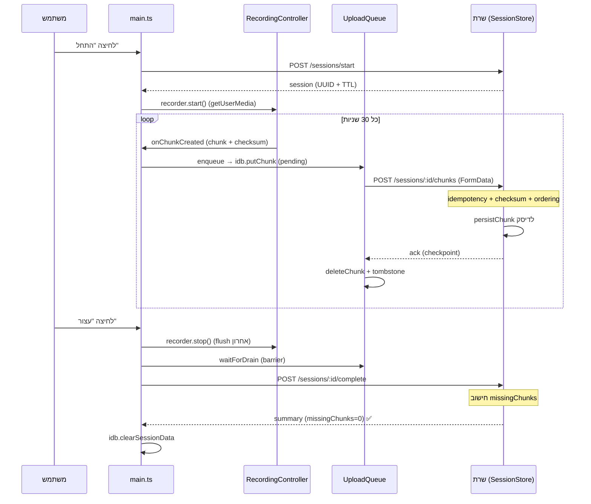

# FLOW של הקלטה — לקוח ושרת

מסמך זה מתאר את הזרימה המלאה של הקלטה רגילה: מרגע הלחיצה על "התחל", דרך הזרמת ה-chunks, ועד השמירה הסופית. כולל את הקריאות בצד הלקוח (frontend) ואת הטיפול בצד השרת (mock-server).

## תמונת-על

הזרימה מחולקת ל-3 שלבים:

1. **התחלה** — פתיחת session מול השרת + הפעלת המיקרופון.
2. **הזרמת chunks** — כל 30 שניות נוצר chunk, נשמר מקומית, ומועלה לשרת.
3. **סגירה/שמירה** — flush אחרון, המתנה שכל ה-chunks יעלו (barrier), וסגירת ה-session.

עמידות מובטחת ע"י:

- **IndexedDB** בצד הלקוח (עמידות מפני קריסה/רענון).
- **`idempotencyKey` יציב** בכל chunk (`session:segment:chunk`) — מונע כפילויות.
- **checksum (sha256)** — אימות שלמות הנתונים בשרת.

---

## שלב 1 — התחלת הקלטה (`handleStart`)

צד לקוח — `frontend/src/main.ts`:

1. `idb.getSession()` — בדיקה אם יש session מקומי פתוח (בהקלטה חדשה — אין).
2. `startFreshSession()` → `api.startSession(clientId, mimePreference)` → **POST `/sessions/start`**.
3. `store.transition("recording")`.
4. `recorder.start(sessionId, segmentIndex)` — `frontend/src/recording-controller.ts`:
   - `navigator.mediaDevices.getUserMedia({ audio: true })` — גישה למיקרופון.
   - `pickMimeType(...)` — בחירת קידוד נתמך (למשל `audio/webm;codecs=opus`).
   - כל `CHUNK_INTERVAL_MS` (30 שניות) מורץ מחזור `MediaRecorder` חדש (start/stop): כל stop פולט **קובץ מדיה שלם ועצמאי** (עם כותרת WebM וקי-פריים משלו), כך שכל chunk ניתן לנגן בנפרד ואיבוד chunk אחד לא שובר את האחרים.
5. `persistLocalSession()` → `idb.saveSession(...)` — שמירת מצב מקומי ל-recovery.

צד שרת — `mock-server/src/session-store.ts` → `startSession()`:

- יוצר `sessionId` (UUID), `status: "active"`.
- קובע `expiresAt` (TTL של interrupted) ו-`finalTtlExpiresAt` (TTL סופי).
- `persistSession()` — כותב `manifest.json` + `checkpoint.json` לדיסק.

---

## שלב 2 — הזרמת chunks תוך כדי הקלטה

כל 30 שניות `MediaRecorder` יורה `ondataavailable` → `emitChunk` → הקולבק `onChunkCreated`:

1. **חישוב מטא-דאטה** (`recording-controller.ts`):
   - `blob.arrayBuffer()` + `sha256Hex(buf)` — checksum.
   - בניית `ChunkMetadata` עם `idempotencyKey` יציב.
2. `store.update({ chunksCreated + 1 })`.
3. `persistLocalSession()` → `idb.saveSession(...)`.
4. `queue.enqueue(meta, blob)` — `frontend/src/upload-queue.ts`:
   - `idb.putChunk(record)` — שמירה ב-IndexedDB עם status `pending`.
   - `queue.process()` — עיבוד תור **FIFO**.
5. `applyStoragePressure()` — בדיקת לחץ אחסון; אם "hard" עוצר הקלטה זמנית.

### העלאת chunk (`queue.process` → `uploader.upload`)

צד לקוח — `frontend/src/chunk-uploader.ts`:

- בונה `FormData` עם `meta` + `blob` ושולח **POST `/sessions/:id/chunks`**.
- **retry עם exponential backoff** (עד `maxRetriesPerChunk`), עם `AbortController` ל-timeout.
- בהצלחה מקבל `ack` → `acknowledgeLocally`:
  - `idb.deleteChunk(...)` — מחיקת ה-blob המקומי (retention).
  - `idb.putTombstone(...)` — סימון שהתקבל (מונע העלאה חוזרת).
  - עדכון מונים (`chunksUploaded` / `chunksDuplicate`).
- כישלונות רצופים רבים → **circuit breaker** עוצר את התור.

צד שרת — `session-store.ts` → `acceptChunk()`:

1. `getRecordOrThrow` + `refreshStatus` — בדיקת קיום ו-TTL של ה-session.
   - `expired` → `SESSION_EXPIRED`; `completed` → `SESSION_NOT_RESUMABLE`.
2. העלאה מחייה session שהיה `interrupted` → חוזר ל-`active`.
3. **Idempotency**: אם `idempotencyKey` כבר קיים → מחזיר ACK עם `duplicate: true` בלי אחסון חוזר.
4. **Checksum**: אימות `checksumAlgo` + `sha256Hex(blob) === meta.checksum`, אחרת `CHECKSUM_MISMATCH`.
5. **Ordering**: מקבל רק `chunkIndex === lastAccepted + 1` לכל segment, אחרת `OUT_OF_ORDER_CHUNK`.
6. `persistChunk(...)` — כתיבת ה-blob לדיסק (`segment-X/chunk-Y.webm`).
7. עדכון `lastAcceptedChunkIndexBySegment` + `persistSession()`.
8. מחזיר `ChunkAck` עם ה-checkpoint העדכני.

---

## שלב 3 — סגירת ושמירת ההקלטה (`handleStop`)

צד לקוח — `frontend/src/main.ts`:

1. `recorder.stop()` — `recording-controller.ts`:
   - עצירת `MediaRecorder` → chunk אחרון (flush).
   - `flushPending()` — המתנה לסיום כל pipeline (persist + enqueue).
   - `teardown()` — עצירת tracks של המיקרופון.
2. **Complete barrier** → `waitForDrain()`: המתנה עד `queue.pendingCount() === 0` (או circuit break).
3. `api.completeSession(...)` → **POST `/sessions/:id/complete`** עם:
   - `expectedLastSegmentIndex`, `expectedLastChunkIndexBySegment`, `idempotencyKey` (`complete:<sessionId>`).
4. אם `missingChunks.length === 0` → `store.transition("success")`. אחרת → מצב שגיאה ("הושלם חלקית").
5. ניקוי מקומי: `idb.clearSessionData(sessionId)` + `idb.clearSession()`.

צד שרת — `session-store.ts` → `completeSession()`:

1. **Idempotent complete**: אם `idempotencyKey` כבר טופל → מחזיר את ה-summary השמור.
2. אם `expired` → `SESSION_EXPIRED`.
3. חישוב `missingChunks` — השוואת מה שהלקוח ציפה לשלוח מול מה שהתקבל בפועל לכל segment.
4. `status`: `completed` (הכל התקבל) או `completed_with_segments` (חלקי).
5. שמירת ה-summary ל-`completeResults` + `persistSession()`.
6. מחזיר `receivedSegments`, `receivedChunksTotal`, `missingChunks`.

---

## סיכום הקריאות לשרת בהקלטה רגילה

| שלב | קריאת לקוח | Endpoint | טיפול בשרת |
|-----|-----------|----------|-------------|
| התחלה | `api.startSession` | `POST /sessions/start` | `startSession()` — יצירת UUID + TTL + persist |
| לכל chunk (כל 30ש') | `uploader.upload` | `POST /sessions/:id/chunks` | `acceptChunk()` — idempotency + checksum + ordering + persist |
| סגירה | `api.completeSession` | `POST /sessions/:id/complete` | `completeSession()` — חישוב missing + summary אידמפוטנטי |

Endpoints נוספים (recovery, לא בהקלטה רגילה): `POST /sessions/:id/resume`, `GET /sessions/:id/checkpoint`.

---

## דיאגרמת רצף

---

## מטריצת שגיאות בצד השרת (`ProtocolError`)

| קוד | מתי | Retryable |
|-----|-----|-----------|
| `SESSION_NOT_FOUND` | session לא קיים | תלוי בקוד |
| `SESSION_EXPIRED` | עבר ה-TTL הסופי | לא |
| `SESSION_NOT_RESUMABLE` | ה-session כבר הושלם | לא |
| `CHECKSUM_MISMATCH` | ה-checksum לא תואם ל-blob | לא |
| `OUT_OF_ORDER_CHUNK` | `chunkIndex` לא רציף | לא |
| `PAYLOAD_TOO_LARGE` | chunk מעל 25MB | לא |
| `BAD_REQUEST` | שדות חסרים / JSON לא תקין | לא |
| `INTERNAL_UPLOAD_ERROR` | שגיאת שרת כללית | כן |
